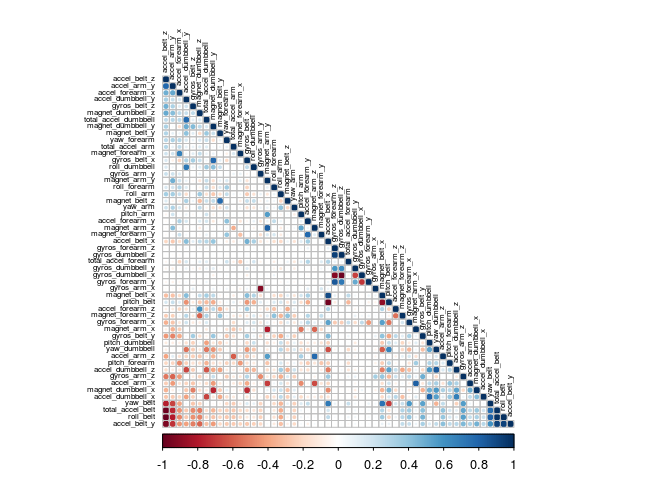
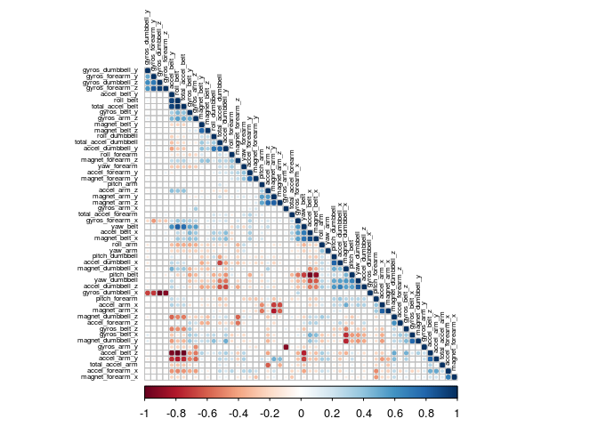

# Final Project - Data Science - 08 - Practical Machine Learning
Justin Smith  
February 27, 2015  
# Summary
This is my submission for the final assignment in the Practical Machine Learning Class, part of the Data Science Specialization on Coursera. The objective of this exercise was to create as accurate a machine learning model as possible using the data provided. The data consisted of a training set with 19,622 observations of 160 variables, and a test set of 20 observations with the same variables minus the outcome. The data came from several activity trackers with subjects doing one of 5 different activities. The outcome variable being predicted was a column designating one of the 5 different activities. In the analysis, variables built from other variables were scrapped (identified by searching for NA values), leaving a dataset with 52 predictors. Using 5-fold cross-validaiton and a random forest model, the estimated out-of-sample accuracy is greater than 99% (error less than 1%). 20 out of the 20 observations in the test set were correctly identified.
  
##1: Data Cleaning/Exploration
  
First, reading in the data and taking a quick peek at the size of the datasets. After reading in the data several times, I took extra care with "NA" and "#DIV/0!"...these kept making many variables character variables or factors, it was annoying.

```r
#Reading in data
train <- read.csv("pml-training.csv",na.strings=c("NA", "#DIV/0!"))
test <- read.csv("pml-testing.csv",na.strings=c("NA", "#DIV/0!"))
row_train <- nrow(train)
col_train <- ncol(train)
row_test <- nrow(test)
col_test <- ncol(test)
```

The training dataset consists of 19622 indiviual observations and 160 variables, while the test dataset consists of only 20 observations and 160 variables. Again, the test set has all the variables except the outcome, 'classe'.
  
Below, I drop a number of variables. The first few columns in the dataset are id and time info, I just get rid of it. I honestly have no idea what to do with it, so I'm dropping it. I don't think it's relvant in the sense that time is important in time-series data sets. 
  
Also, I read through the discussion section in the class and looked at the academic papers made available to us, particularly this one: http://groupware.les.inf.puc-rio.br/public/papers/2012.Ugulino.WearableComputing.HAR.Classifier.RIBBON.pdf. I tried to figure out which variables they were talking about in section 4.2, and I realized that many of the variables are built from other variables. I decided I want to drop these and first tried to filter them out using variable names, as many of them started with "stdvev" or "kurtosis" or "avg" or something along those lines. But this proved difficult, and I noticed that many of the columns I wanted to drop were mostly empty. So I filtered them out by exluding from the dataset those variables that were majority missing values.

```r
#Dropping id/time vars and creating new dataset to play with
train2 <- train[,-c(1:7)]

#Dropping vars with missing observations
train2<-train2[, apply(train2, 2, function(x) !(sum(is.na(x))/length(x))>.5)]

#Lets take a look at the data that was kept
str(train2)
```

```
## 'data.frame':	19622 obs. of  53 variables:
##  $ roll_belt           : num  1.41 1.41 1.42 1.48 1.48 1.45 1.42 1.42 1.43 1.45 ...
##  $ pitch_belt          : num  8.07 8.07 8.07 8.05 8.07 8.06 8.09 8.13 8.16 8.17 ...
##  $ yaw_belt            : num  -94.4 -94.4 -94.4 -94.4 -94.4 -94.4 -94.4 -94.4 -94.4 -94.4 ...
##  $ total_accel_belt    : int  3 3 3 3 3 3 3 3 3 3 ...
##  $ gyros_belt_x        : num  0 0.02 0 0.02 0.02 0.02 0.02 0.02 0.02 0.03 ...
##  $ gyros_belt_y        : num  0 0 0 0 0.02 0 0 0 0 0 ...
##  $ gyros_belt_z        : num  -0.02 -0.02 -0.02 -0.03 -0.02 -0.02 -0.02 -0.02 -0.02 0 ...
##  $ accel_belt_x        : int  -21 -22 -20 -22 -21 -21 -22 -22 -20 -21 ...
##  $ accel_belt_y        : int  4 4 5 3 2 4 3 4 2 4 ...
##  $ accel_belt_z        : int  22 22 23 21 24 21 21 21 24 22 ...
##  $ magnet_belt_x       : int  -3 -7 -2 -6 -6 0 -4 -2 1 -3 ...
##  $ magnet_belt_y       : int  599 608 600 604 600 603 599 603 602 609 ...
##  $ magnet_belt_z       : int  -313 -311 -305 -310 -302 -312 -311 -313 -312 -308 ...
##  $ roll_arm            : num  -128 -128 -128 -128 -128 -128 -128 -128 -128 -128 ...
##  $ pitch_arm           : num  22.5 22.5 22.5 22.1 22.1 22 21.9 21.8 21.7 21.6 ...
##  $ yaw_arm             : num  -161 -161 -161 -161 -161 -161 -161 -161 -161 -161 ...
##  $ total_accel_arm     : int  34 34 34 34 34 34 34 34 34 34 ...
##  $ gyros_arm_x         : num  0 0.02 0.02 0.02 0 0.02 0 0.02 0.02 0.02 ...
##  $ gyros_arm_y         : num  0 -0.02 -0.02 -0.03 -0.03 -0.03 -0.03 -0.02 -0.03 -0.03 ...
##  $ gyros_arm_z         : num  -0.02 -0.02 -0.02 0.02 0 0 0 0 -0.02 -0.02 ...
##  $ accel_arm_x         : int  -288 -290 -289 -289 -289 -289 -289 -289 -288 -288 ...
##  $ accel_arm_y         : int  109 110 110 111 111 111 111 111 109 110 ...
##  $ accel_arm_z         : int  -123 -125 -126 -123 -123 -122 -125 -124 -122 -124 ...
##  $ magnet_arm_x        : int  -368 -369 -368 -372 -374 -369 -373 -372 -369 -376 ...
##  $ magnet_arm_y        : int  337 337 344 344 337 342 336 338 341 334 ...
##  $ magnet_arm_z        : int  516 513 513 512 506 513 509 510 518 516 ...
##  $ roll_dumbbell       : num  13.1 13.1 12.9 13.4 13.4 ...
##  $ pitch_dumbbell      : num  -70.5 -70.6 -70.3 -70.4 -70.4 ...
##  $ yaw_dumbbell        : num  -84.9 -84.7 -85.1 -84.9 -84.9 ...
##  $ total_accel_dumbbell: int  37 37 37 37 37 37 37 37 37 37 ...
##  $ gyros_dumbbell_x    : num  0 0 0 0 0 0 0 0 0 0 ...
##  $ gyros_dumbbell_y    : num  -0.02 -0.02 -0.02 -0.02 -0.02 -0.02 -0.02 -0.02 -0.02 -0.02 ...
##  $ gyros_dumbbell_z    : num  0 0 0 -0.02 0 0 0 0 0 0 ...
##  $ accel_dumbbell_x    : int  -234 -233 -232 -232 -233 -234 -232 -234 -232 -235 ...
##  $ accel_dumbbell_y    : int  47 47 46 48 48 48 47 46 47 48 ...
##  $ accel_dumbbell_z    : int  -271 -269 -270 -269 -270 -269 -270 -272 -269 -270 ...
##  $ magnet_dumbbell_x   : int  -559 -555 -561 -552 -554 -558 -551 -555 -549 -558 ...
##  $ magnet_dumbbell_y   : int  293 296 298 303 292 294 295 300 292 291 ...
##  $ magnet_dumbbell_z   : num  -65 -64 -63 -60 -68 -66 -70 -74 -65 -69 ...
##  $ roll_forearm        : num  28.4 28.3 28.3 28.1 28 27.9 27.9 27.8 27.7 27.7 ...
##  $ pitch_forearm       : num  -63.9 -63.9 -63.9 -63.9 -63.9 -63.9 -63.9 -63.8 -63.8 -63.8 ...
##  $ yaw_forearm         : num  -153 -153 -152 -152 -152 -152 -152 -152 -152 -152 ...
##  $ total_accel_forearm : int  36 36 36 36 36 36 36 36 36 36 ...
##  $ gyros_forearm_x     : num  0.03 0.02 0.03 0.02 0.02 0.02 0.02 0.02 0.03 0.02 ...
##  $ gyros_forearm_y     : num  0 0 -0.02 -0.02 0 -0.02 0 -0.02 0 0 ...
##  $ gyros_forearm_z     : num  -0.02 -0.02 0 0 -0.02 -0.03 -0.02 0 -0.02 -0.02 ...
##  $ accel_forearm_x     : int  192 192 196 189 189 193 195 193 193 190 ...
##  $ accel_forearm_y     : int  203 203 204 206 206 203 205 205 204 205 ...
##  $ accel_forearm_z     : int  -215 -216 -213 -214 -214 -215 -215 -213 -214 -215 ...
##  $ magnet_forearm_x    : int  -17 -18 -18 -16 -17 -9 -18 -9 -16 -22 ...
##  $ magnet_forearm_y    : num  654 661 658 658 655 660 659 660 653 656 ...
##  $ magnet_forearm_z    : num  476 473 469 469 473 478 470 474 476 473 ...
##  $ classe              : Factor w/ 5 levels "A","B","C","D",..: 1 1 1 1 1 1 1 1 1 1 ...
```
  
Let me create two correlation plots to show that there is some remarkable patterns present in the dataset. Again, I am plotting the data twice, I am just switching how the corrplot() package groups the correlation. The groupings of high neg/pos correlations mostly relate to the x-y-z directions of the same activity device, however this is not always the case.

```r
library(corrplot)
M=cor(train2[,-53],use="pairwise.complete.obs")
p = M
corrplot(M, method="circle", type="lower", tl.cex = 0.5, tl.col = "black", tl.pos = "ld"
         , order = "FPC")
```

 

```r
corrplot(M, method="circle", type="lower", tl.cex = 0.5, tl.col = "black", tl.pos = "ld"
                  , order = "hclust")
```

 
   
##2: Modelling/Random Forest
   
Using the caret package I split the training data set using a .75/.25 proportion. I use the .75 chunk for the 5-fold cross-validation to build the model. I use the .25 chunk as my test set to estimate the out-of-sample accuracy/error. Originally, I was going to do 10 folds, but I don't have the patience for my little Chromebook, so I settled for 5. Below I am running a random forest model using all 52 predictors. The final model ended up using 27 trees as it had the highest estimated accuracy.

```r
#loading caret package
library(caret)
```

```
## Loading required package: lattice
## Loading required package: ggplot2
```

```r
#creating the train and test set
inTrain = createDataPartition(train2$classe, p = 3/4)[[1]]
training = train2[ inTrain,]
testing = train2[-inTrain,]

# 5-folds cross validation using the training created just above
set.seed(12345)
train_control <- trainControl(method="cv", number=5,allowParallel=T)
#Running rf model using the folds
rf_model <- train(classe~., data=training, trControl=train_control, method="rf")
```

```
## Loading required package: randomForest
## randomForest 4.6-12
## Type rfNews() to see new features/changes/bug fixes.
## 
## Attaching package: 'randomForest'
## 
## The following object is masked from 'package:ggplot2':
## 
##     margin
```

```r
# summarize results...using the 5 folds it settled for using 27 trees
print(rf_model)
```

```
## Random Forest 
## 
## 14718 samples
##    52 predictor
##     5 classes: 'A', 'B', 'C', 'D', 'E' 
## 
## No pre-processing
## Resampling: Cross-Validated (5 fold) 
## Summary of sample sizes: 11774, 11774, 11775, 11774, 11775 
## Resampling results across tuning parameters:
## 
##   mtry  Accuracy   Kappa      Accuracy SD  Kappa SD   
##    2    0.9900122  0.9873632  0.002756269  0.003489847
##   27    0.9913710  0.9890844  0.001870679  0.002366957
##   52    0.9855957  0.9817767  0.002446046  0.003094815
## 
## Accuracy was used to select the optimal model using  the largest value.
## The final value used for the model was mtry = 27.
```
   
Here I use the test set I created from the .25 chunk of the training data. I am using it to predict the out-of-sample accruacy/error, which is greater than 99% and less than 1% respectively. That's amazing.

```r
#99% accuracy...dammmnnnnnnnn
pred_train <- predict(rf_model, newdata=testing)
confusionMatrix(pred_train, testing$classe)
```

```
## Confusion Matrix and Statistics
## 
##           Reference
## Prediction    A    B    C    D    E
##          A 1394    8    0    0    0
##          B    1  941    7    0    1
##          C    0    0  846    1    2
##          D    0    0    2  803    1
##          E    0    0    0    0  897
## 
## Overall Statistics
##                                         
##                Accuracy : 0.9953        
##                  95% CI : (0.993, 0.997)
##     No Information Rate : 0.2845        
##     P-Value [Acc > NIR] : < 2.2e-16     
##                                         
##                   Kappa : 0.9941        
##  Mcnemar's Test P-Value : NA            
## 
## Statistics by Class:
## 
##                      Class: A Class: B Class: C Class: D Class: E
## Sensitivity            0.9993   0.9916   0.9895   0.9988   0.9956
## Specificity            0.9977   0.9977   0.9993   0.9993   1.0000
## Pos Pred Value         0.9943   0.9905   0.9965   0.9963   1.0000
## Neg Pred Value         0.9997   0.9980   0.9978   0.9998   0.9990
## Prevalence             0.2845   0.1935   0.1743   0.1639   0.1837
## Detection Rate         0.2843   0.1919   0.1725   0.1637   0.1829
## Detection Prevalence   0.2859   0.1937   0.1731   0.1644   0.1829
## Balanced Accuracy      0.9985   0.9946   0.9944   0.9990   0.9978
```
   
##3: Prediction on Test Set
  
The final step is to predict on the test data set of 20 observations. My first step is to match the 52 variables I kept in the training set, and then to predict using my model. I got a 20/20 on the quiz using the predicted values shown below.

```r
#Time to have the test dataset match the training dataset...except for the "classe" var
colnames <- names(train2[,-53])
test2 <- test[,colnames]

#Predicting on the test set
pred_test <- predict(rf_model, newdata=test2)

#Here are the predicted values
pred_test
```

```
##  [1] B A B A A E D B A A B C B A E E A B B B
## Levels: A B C D E
```
  
Thanks for reading ya'll.
